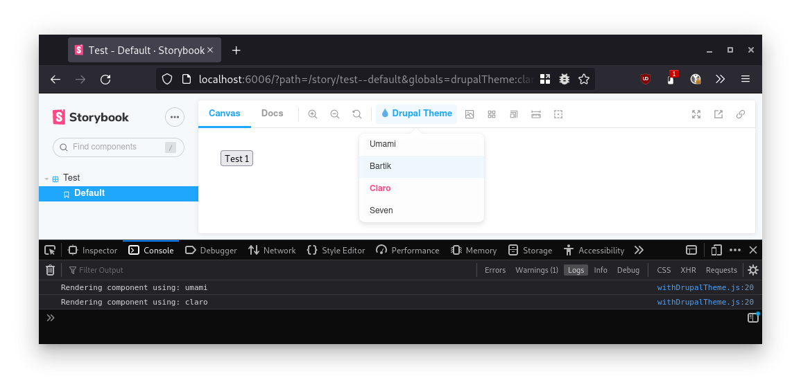

# Drupal Storybook Addon

A library for best-practice Drupal integration addons in Storybook:

- Easy-to-use Drupal integration
- Simple drop-down menu
- URL-linkable state for sharing



## Configure your Drupal site

### 🌳 Install the Drupal module

Install and enable the Drupal module:

```console
composer require drupal/cl_server;
drush pm:enable --yes cl_server;
```

### 🌴 Add Storybook to your Drupal repo

From the root of your repo:

```console
yarn global add sb@latest;
sb init --builder webpack5 --type server
# If you have a reason to use Webpack4 use the following instead:
# sb init --type server
yarn add -D @lullabot/storybook-drupal-addon
```

### 🌵 Configure Storybook

First enable the addon. Add it to the `addons` in the `.storybook/main.js`.

Set the `staticDirs` path to your Drupal root (usually `web`). This allows us to enable local development for CSS/JS assets.

```javascript
// .storybook/main.js
module.exports = {
  // ...
  addons: [
    // ...
    '@lullabot/storybook-drupal-addon',
  ],
  staticDirs: ['../web'],
  // ...
};
```

Then, configure the `supportedDrupalThemes`, `localDev` and `drupalTheme` parameters in `.storybook/preview.js`.

`supportedDrupalThemes` is an object where the keys are the machine name of the Drupal themes and the values are the plain text name of that Drupal theme you want to use. This is what will appear in the dropdown in the toolbar.

`localDev` is a boolean (default `false`) that indicates where Storybook JS/CSS assets should point to local folders. This allows a themer to preview the Storybook components using local CSS/JS files. Notice that this option just **replaces CSS/JS paths** on the Storybook rendered page. Twig files still come from the `server.url` Drupal website!

```javascript
// .storybook/preview.js
export const parameters = {
  // ...
  server: {
    // Replace this with your Drupal site URL, or an environment variable.
    url: 'http://local.contrib.com',
  },
  drupalTheme: 'umami',
  localDev: true,
  supportedDrupalThemes: {
    umami: { title: 'Umami' },
    bartik: { title: 'Bartik' },
    claro: { title: 'Claro' },
    seven: { title: 'Seven' },
  },
  // ...
};
```

## Start Storybook

Start the development server Storybook server. Locate the static path to the Drupal root:

```console
yarn storybook
```

---

## Storybook addon authors

As an addon author, you can use this library by adding it as a dependency and adding the following to your `/preset.js` file:

```js
function config(entry = []) {
  return [
    ...entry,
    require.resolve('@lullabot/storybook-drupal-addon/preview'), // <-- library's preview preset
    require.resolve('./dist/esm/preset/preview'), // <-- your addon's preview preset (if present)
  ];
}

function managerEntries(entry = []) {
  return [
    ...entry,
    require.resolve('@lullabot/storybook-drupal-addon/manager'),
    require.resolve('./dist/esm/preset/manager'), // <-- your addon's manager (if present)
  ];
}

module.exports = { config, managerEntries };
```

The currently selected theme is available in the `drupalTheme` global, so you can access it using the following snippet:

```js
import { useGlobals } from '@storybook/client-api';

const myDecorator = (story, context) => {
  const [{ drupalTheme }] = useGlobals();
  // Do something with the Drupal theme.
};
```
